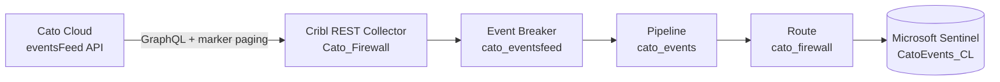

# Onboarding Cato Networks Firewall to Microsoft Sentinel via Cribl Stream


Cato Networks exposes security, network, and audit events through its **eventsFeed** GraphQL API. This runbook pulls those events into Cribl Stream with a **REST Collector** using marker-based pagination, breaks and parses them, and routes them to Microsoft Sentinel.

> [!NOTE]
> Sensitive values (account ID, API key, Cribl Cloud endpoint) are redacted. Substitute your own.

## Table of Contents

- [Architecture](#architecture)
- [Prerequisites](#prerequisites)
- [Step 1 — Create the REST Collector](#step-1--create-the-rest-collector)
- [Step 2 — Event Breaker](#step-2--event-breaker)
- [Step 3 — Pipeline (parse and normalize)](#step-3--pipeline-parse-and-normalize)
- [Step 4 — Route](#step-4--route)
- [Step 5 — Microsoft Sentinel destination](#step-5--microsoft-sentinel-destination)
- [Verification](#verification)
- [Troubleshooting](#troubleshooting)

---

## Architecture



## Prerequisites

- A Cato API key (read-only) and your Cato **Account ID**.
- The Cato API endpoint/region URL.
- A Cribl worker group that can reach the Cato API over HTTPS.
- The Microsoft Sentinel destination configured (see [README](./README.md#configuring-the-microsoft-sentinel-destination-shared-step)).

> [!TIP]
> The eventsFeed API uses a **marker** that advances each poll. Cribl stores the marker as collector state so each run resumes where the last one stopped. Long-lived read-only keys are easiest to operate; set a rotation reminder well ahead of expiry, because an expired key makes collection stop quietly rather than erroring loudly.

---

## Step 1 — Create the REST Collector

**Data → Sources → Collectors → REST → Add Collector.**

| Setting | Value |
|---|---|
| **Collector ID** | `cato_eventsfeed` |
| **Collect method** | `POST` |
| **Collect URL** | `https://<CATO_API_ENDPOINT>/api/v1/graphql2` |
| **Authentication** | Custom header — `x-api-key: <CATO_API_KEY>` (store as a Cribl secret) |

**Request body** (GraphQL query with the marker variable):

```json
{
  "query": "query eventsFeed($accountIDs:[ID!]!,$marker:String){ eventsFeed(accountIDs:$accountIDs, marker:$marker){ marker fetchedCount accounts{ records{ time fieldsMap } } } }",
  "variables": {
    "accountIDs": ["<CATO_ACCOUNT_ID>"],
    "marker": "${cribl_state.marker}"
  }
}
```

**Pagination:** Response-based. Extract `data.eventsFeed.marker` and feed it back as the next request's `marker`. Stop when `fetchedCount` is `0`.

**Result Settings:**

- **Discover / Collect array path:** `data.eventsFeed.accounts.0.records`
- Each element becomes one event.

> [!WARNING]
> The events array is **top-level** in the response body. When importing sample data to build the pipeline, set **Data `_raw` = Off** so Cribl treats each record as a discrete event rather than wrapping the whole payload in `_raw`.

---

## Step 2 — Event Breaker

**Processing → Knowledge → Event Breaker Rulesets → Add Ruleset.**

| Setting | Value |
|---|---|
| **Ruleset name** | `cato_eventsfeed` |
| **Break type** | JSON Array |
| **Array field** | `records` |
| **Timestamp** | field `time`, format `%s%3N` (epoch millis) |

Attach this ruleset to the collector under **Result Settings → Event Breakers**.

> [!IMPORTANT]
> Confirm the collector emits `cribl_breaker: cato_eventsfeed`. If it shows `Cribl:ndjson`, the ruleset is not attached to the collector's Result Settings — the sample-import view alone does not fix the production path.

---

## Step 3 — Pipeline (parse and normalize)

**Processing → Pipelines → Add Pipeline → `cato_events`.**

The Cato records carry their real fields inside a flat `fieldsMap` object. Flatten it, then normalize a few names Sentinel will key on.

### Function 1 — Eval (flatten `fieldsMap`)

| Field | Value |
|---|---|
| `event_type` | `fieldsMap.event_type` |
| `action` | `fieldsMap.action` |
| `src_ip` | `fieldsMap.src_ip` |
| `dest_ip` | `fieldsMap.dest_ip` |
| `rule_name` | `fieldsMap.rule_name` |
| `application_name` | `fieldsMap.application_name` |
| `event_sub_type` | `fieldsMap.event_sub_type` |

### Function 2 — Eval (fix `_time` if needed)

If timestamps land far in the past/future, the epoch is in millis and needs dividing:

| Field | Value |
|---|---|
| `_time` | `Number(time) / 1000` |

### Function 3 — Drop (optional volume reduction)

Cato's `Monitor`/DNS events are the bulk of volume. Keep `Block` and `Alert` for the SOC and sample the rest:

| Setting | Value |
|---|---|
| Filter | `action=='Monitor' && Math.random() > 0.2` |

Start with this **off**; turn it on after you've seen a full day and know what's actually noisy.

---

## Step 4 — Route

**Routing → Data Routes → Add Route**, placed above your catch-all.

| Setting | Value |
|---|---|
| Route name | `cato_firewall` |
| Filter | `__collectible.collectorId=='cato_eventsfeed'` |
| Pipeline | `cato_events` |
| Output | `microsoft_sentinel` |
| Final | `Yes` |

---

## Step 5 — Microsoft Sentinel destination

Route the output to the shared **Microsoft Sentinel** destination. Target custom table: **`CatoEvents_CL`**.

DCR field mapping (representative):

| Cribl field | Sentinel column |
|---|---|
| `_time` | `TimeGenerated` |
| `event_type` | `EventType` |
| `action` | `DeviceAction` |
| `src_ip` | `SourceIP` |
| `dest_ip` | `DestinationIP` |
| `rule_name` | `RuleName` |
| `application_name` | `ApplicationName` |

See the [README shared destination step](./README.md#configuring-the-microsoft-sentinel-destination-shared-step) for DCE/DCR/secret setup.

---

## Verification

```kql
CatoEvents_CL
| where TimeGenerated > ago(1h)
| summarize Events = count() by DeviceAction
| sort by Events desc
```

You should see a mix of `Block`, `Monitor`, and `Alert`. If only `Monitor` appears, your sample under-represented blocks — that's expected on quiet windows, not an error.

## Troubleshooting

| Symptom | Likely cause | Fix |
|---|---|---|
| `cribl_breaker: Cribl:ndjson` | Breaker not attached to collector Result Settings | Attach `cato_eventsfeed` ruleset there, not just in sample import |
| Events wrapped in one blob | `Data _raw` left On during import | Re-import with `Data _raw = Off` |
| `_time` absurd | Epoch in millis parsed as seconds | Apply `_time = Number(time)/1000` in pipeline |
| Collection silently stops | Expired API key | Rotate key; set a reminder ~2 weeks before expiry |
